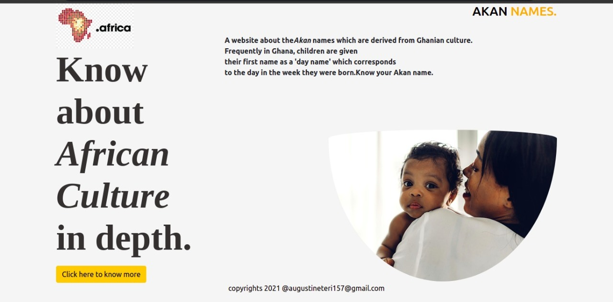
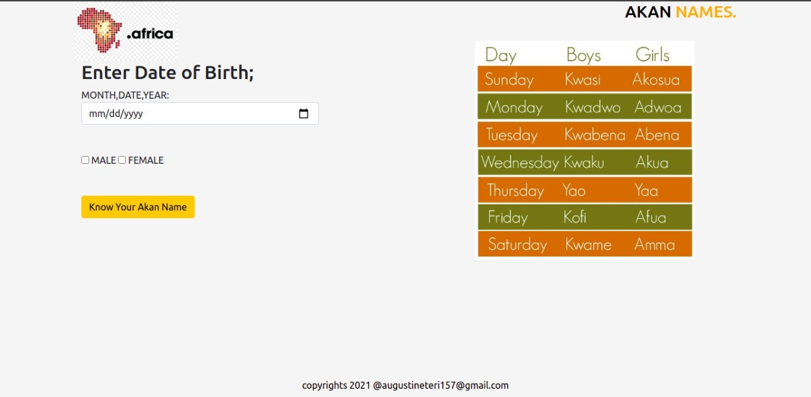

## Akan Names
A name calculator website build based on HTML,CSS and Javascript.11/12/2021

By Kubai Augustine Mweteri

## Description
A web application that takes a user's birthday and calculates the day of the week they were born and then, depending on their gender outputs their Akan Name.
## How it Works
1.Click to know more button 2.Enter your details date 3.Choose gender 4.Click on know your Akan name 5.Your name displays.

## Design

## Setup/Installation Requirements
1)Install the Visual studio code 2)Git clone the repository 3)Make sure the live server extension is installed 4)Click on Go live

## BDD

## Todo list
1)Design 2)Execute for use.

## Known Bugs
The Website works just fine,there are no bugs.
## Technologies Used
1)HTML  2)CSS. 3) Javascript
## Support and contact details
Email Address;augustineteri157@gmail.com

## License
Copyright (c) [2021] Kubai Augustine Mweteri